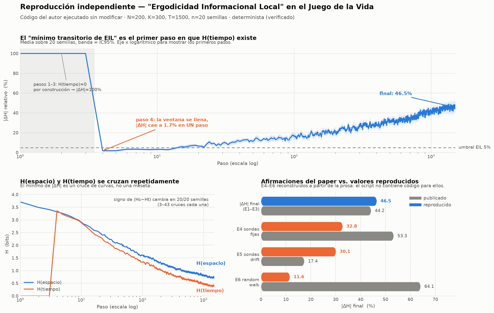

# Revisión y reproducción — «Ergodicidad Informacional Local Transitoria en el Juego de la Vida de Conway»

Materiales revisados: `spacetime_complete.py`, `spacetime_es.docx`, `clarifications.docx`.
Reproducción ejecutada el 2026-09-18 · Python 3.11.15 · numpy 2.4.6 · scipy 1.17.1.



---

## 1. Veredicto corto

El código **corre sin modificaciones y es completamente determinista** (re-ejecutar
la semilla 42 da arrays bit a bit idénticos). Por lo tanto los números del paper
deberían reproducirse exactamente. **No lo hacen.** Además, tres de los seis
experimentos declarados en la Sección 3.2 no tienen código en el script entregado.

Pero lo más importante no son las discrepancias numéricas, que son moderadas.
Son dos problemas estructurales:

> **1 · «H(tiempo)» no es una entropía temporal.** `spatial_h()` y `temporal_h()`
> son la misma operación: un histograma de 300 muestras, una por sonda, en el
> mismo instante. Los dos lados de |ΔH| son promedios de ensemble; el script no
> calcula ningún promedio temporal. Como la ergodicidad *es* la igualdad entre
> promedio temporal y promedio de ensemble, el marco entero de la Sección 2 no se
> corresponde con lo que el código mide. Detalle en §5-bis.

> **2 · El «mínimo transitorio de EIL» es el arranque de la ventana.**
> `temporal_h()` devuelve `0.0` mientras el buffer tiene menos de 4 grillas, lo
> que fuerza `|ΔH| = 100%` en los pasos 1–3. En el paso 4 —el primer paso en que
> H(tiempo) está definido— `|ΔH|` cae a 1,74% de media, ya por debajo del umbral
> EIL del 5%, en **un solo paso**.

La Fase 2 del paper («la densidad colapsa, H(espacio) cae hacia H(tiempo) que sube
lentamente, convergen brevemente») no describe lo que hacen los datos.

---

## 2. Reproducción de E1–E3 / E7 (el experimento que sí tiene código)

`python3 spacetime_complete.py`, N=200, K=300, T=1500, las mismas 20 semillas.

| Magnitud | Paper | Reproducido | |
|---|---|---|---|
| \|ΔH\| final (IC95%) | 44,2% ± 4,6% | **46,5% ± 4,7%** | ≈ |
| \|ΔH\| mínimo | 0,32% ± 0,21% | **0,14% ± 0,16%** | ✗ |
| r(H(tiempo), \|ΔH\|) | −0,721, p=0,0003 | **−0,742, p=0,0002** | ≈ |
| H(esp) > H(t) final | p < 0,0001 | **p = 2,7×10⁻¹²** | ✓ |
| Heterogeneidad sube | 14/20, p=0,007 | **16/20, p=0,0092** | ✗ |
| H(espacio) final | 0,767 bits | **0,731 bits** | ≈ |
| H(tiempo) final | 0,428 bits | **0,392 bits** | ≈ |

Datos por semilla en `datos_reproducidos.txt`.

Las direcciones y las conclusiones cualitativas se sostienen. Pero con un
generador determinista y semillas fijas, «≈» no es aceptable: **14/20 no puede
convertirse en 16/20 por azar**. Los valores publicados provienen de una versión
del código distinta de la entregada. La afirmación de portada «Todos los números
verificados desde archivos .npy» no es verificable con este artefacto.

---

## 3. Error de reporte en la Sección 4.3

El paper reporta:

> H(espacio) en el mínimo EIL: 3,729 bits · H(tiempo) en el mínimo EIL: 0,000 bits

Esos dos valores son **internamente contradictorios con el propio paper**: dan
|ΔH| = |3,729 − 0| / 3,729 = **100%**, no 0,32%.

Los valores reales en el paso donde `d` alcanza su mínimo son:

```
H(espacio) en el mínimo = 2,324 bits
H(tiempo)  en el mínimo = 2,326 bits     → |ΔH| ≈ 0,1%  ✓ coherente
```

3,708 / 0,000 son los valores **del paso 1**, donde H(tiempo) vale cero por
construcción. Es decir: se reportaron los valores iniciales etiquetados como
«en el mínimo EIL». Esto hay que corregirlo; tal como está, sostiene la narrativa
de la Fase 2 con los números equivocados.

---

## 4. El mínimo es un cruce de curvas, no una meseta

`H(espacio)` decrece desde ~3,7 bits; `H(tiempo)` salta de 0 a ~3,4 bits en el
paso 4 y luego decrece más rápido. Las dos curvas **se cruzan**, y el signo de
(Hs − Ht) cambia en **20/20 semillas**, entre 3 y 43 veces cada una.

Por el teorema del valor intermedio, dos curvas que se cruzan fuerzan
|ΔH| → 0. El «mínimo» medido no cuantifica ergodicidad: cuantifica la
**resolución temporal del cruce**. Cuantos más cruces, menor el mínimo — lo que
explica que sea ~0 en las 20 semillas. «Robusto en 20/20» es aquí una
tautología, no un resultado.

Magnitud del transitorio: `|ΔH| < 5%` durante **28 pasos de media sobre 1500
(1,87% de la corrida)**, con rachas contiguas de 3 a 11 pasos. El mínimo cae en
la mediana del paso 12, con densidad media del 18% — plena Fase 1 (caos), no
Fase 2.

---

## 5. Experimentos sin código

El script no contiene implementación de sondas drift, random walk, ni de la
métrica asimétrica. Los únicos aciertos de `grep` para «drift» están en la
prosa del docstring. Esto afecta a **C1 y C3, dos de las seis conclusiones**.

Reconstruí E4/E5/E6 siguiendo la prosa de la Sección 3.2 (`probe_experiments.py`,
N=100, K=150, T=500, 10 semillas):

| | Paper | Reconstruido |
|---|---|---|
| E4 sondas fijas | 53,3% | **32,8% ± 5,8%** |
| E5 sondas drift | 17,4% | **30,1% ± 5,8%** (regla «vecino más activo») |
| E5 sondas drift | 17,4% | **58,4% ± 5,2%** (regla «vecino con valor=1») |
| E6 random walk | 64,1% | **11,6% ± 1,1%** |
| reducción drift vs fija | 67% | **8%** |

Tres observaciones:

1. **La reconstrucción de E4 está validada de forma cruzada.** El experimento
   principal (N=200) promediado sobre los pasos 450–500 da 31,4%, frente al
   32,8% de mi E4 a T=500. Coinciden. Es el 53,3% del paper el que queda fuera.
   De paso: la divergencia todavía está creciendo en t=500 (31%) y llega a 46%
   en t=1500, así que **E4–E6 a T=500 no son comparables con E1–E3 a T=1500**;
   la Tabla 1 los pone en la misma columna.

2. **E5 depende críticamente de una definición que el paper nunca da.** Las dos
   lecturas razonables de «se mueve hacia la celda vecina más activa» dan 30% y
   58%. Ninguna da 17,4%. La conclusión C3 («reducción del 67%») no es
   reproducible a partir del material entregado.

3. **E6 contradice su propia justificación.** El paper invalida E6 porque el
   random walk «contamina H(tiempo) con varianza espacial». Pero esa
   contaminación hace que la traza temporal se parezca a un muestreo espacial,
   lo que debe **bajar** |ΔH|, no subirlo a 64,1%. Mi reconstrucción da 11,6%,
   el valor **más bajo** de los tres — que es la dirección que predice el propio
   argumento del paper. El 64,1% publicado parece ir al revés.

Sobre C1: reconstruida, la métrica asimétrica (ventana de 2 pasos) da 55,1%
frente a 32,8% de la simétrica, una reducción del **40,4%**, no del 20,8%.

---

## 5-bis. El problema de fondo: la métrica nunca mide tiempo

Esto es más grave que cualquier discrepancia numérica de las secciones
anteriores, y se ve directamente en el código.

`spatial_h()` y `temporal_h()` tienen **la misma estructura**: las dos hacen
`for cx, cy in probes` y acumulan un histograma de 300 muestras, una por sonda.

```python
def spatial_h(g, probes):        # 300 muestras: bloque 2x2 de cada sonda
    for cx, cy in probes: counts[key] += 1

def temporal_h(hist4, probes):   # 300 muestras: palabra de 4 pasos de cada sonda
    for cx, cy in probes: counts[key] += 1
```

Las dos son **promedios de ensemble sobre el mismo conjunto de sondas, en el
mismo instante**. En ningún punto del script se calcula un promedio temporal.

La ergodicidad es, por definición, la igualdad entre un promedio temporal y un
promedio de ensemble. Aquí los dos lados del cociente son promedios de ensemble.
Lo que |ΔH| compara no es espacio contra tiempo: es **dos libros de códigos
distintos (bloques 2×2 contra palabras de 4 pasos) evaluados sobre la misma
muestra de 300 sondas**. El marco de «ergodicidad», y con él la definición de
EIL de la Sección 2, no se corresponde con lo que el código mide.

### Qué pasa si se mide de verdad

Calculé la entropía temporal real de un observador local —una sonda, la
distribución de sus palabras de 4 pasos **a lo largo de 300 pasos**— en el
régimen tardío:

| | semilla 42 | semilla 137 | semilla 271 |
|---|---|---|---|
| H(espacio), ensemble | 0,658 | 0,866 | 0,558 |
| H(tiempo) **del paper** (pool sobre sondas) | 0,431 | 0,406 | 0,315 |
| H(tiempo) **real** (por observador, sobre t) | 0,330 | 0,162 | 0,128 |
| mediana por observador | **0,000** | **0,000** | **0,000** |
| sondas con H temporal exactamente 0 | 182/300 | 240/300 | 258/300 |

El observador local **mediano tiene entropía temporal exactamente cero**: está
sobre una still-life o una región muerta, y su ventana de 4 pasos nunca cambia.
Entre el 61% y el 86% de las sondas están en ese caso.

Es decir: el efecto real es mucho más extremo que el que reporta el paper, pero
también mucho menos interesante, porque es la definición del estado asintótico
del Juego de la Vida. El 0,43 bits que el paper atribuye a «las dinámicas
periódicas locales» es en su mayor parte **variedad espacial entre sondas**, no
variedad temporal: son sondas distintas congeladas en palabras distintas.

---

## 6. Problemas metodológicos que sobreviven a la reproducción

Estos no dependen de qué versión del código produjo los números.

**6.1 · El arranque de H(tiempo) contamina la métrica.** Los pasos 1–3 no son
«|ΔH| = 100%, el sistema es máximamente no ergódico»; son «la métrica no está
definida todavía». Deberían excluirse, no promediarse. Tal como está, la
transición artificial 100% → 1,7% *es* el hallazgo principal del paper.

**6.2 · La normalización relativa amplifica ruido al final.** `|ΔH| = |Hs−Ht| /
max(Hs,Ht)` con Hs ≈ 0,73 bits: el denominador es pequeño y cae a lo largo de la
corrida, así que la divergencia relativa crece **aunque la diferencia absoluta se
encoja**. La densidad final es 3,7%, con lo que ~86% de los bloques 2×2 son
`0000`; ambas entropías son estimaciones de cola pequeña. Buena parte del ascenso
del 31% al 46% entre t=500 y t=1500 es este efecto de denominador, no un
«desacoplamiento estructural» creciente.

**6.3 · Sesgo del estimador de entropía.** K=300 muestras sobre 16 bins: el sesgo
de Miller-Madow es ~0,036 bits (0,9% de la escala). Es pequeño frente al efecto
principal, pero del mismo orden que el «mínimo de 0,32%» que se reporta con tres
cifras significativas.

**6.4 · La correlación r = −0,742 tiene un suelo algebraico de ≈ −0,53.**
Este es el problema más serio del experimento de mecanismo. `fin_d` **se calcula
a partir de** `fin_ht`: al final del run Hs > Ht en las 20 semillas, así que
|ΔH| = (Hs−Ht)/Hs exactamente (verificado: desviación máxima 0,005). Correlacionar
Ht con una cantidad que es función decreciente de Ht no es un hallazgo empírico.

Lo cuantifiqué con un test de permutación que destruye cualquier vínculo real
entre Hs y Ht pero conserva la forma algebraica: permutando Hs entre semillas,
r(Ht, (Hs−Ht)/Hs) sigue dando **−0,529 de media**. Es decir: de los −0,742
observados, aproximadamente −0,53 son identidad algebraica y sólo el resto es
estructura. El p = 0,0002 se calcula contra el nulo r = 0, que es el nulo
equivocado.

La aclaración del autor (`clarifications.docx`, punto 2) responde a una objeción
distinta —defiende n=20 frente a n=T×20, y tiene razón en eso— pero no a esta.
El problema no es el tamaño muestral sino que las dos variables no son
independientes.

Un dato que refuerza el punto: r(H(espacio)_final, |ΔH|_final) = **−0,128
(p = 0,59)**. Si el mecanismo fuera realmente «H(espacio) refleja diversidad
global frente a H(tiempo) acotado», Hs debería tener poder predictivo. No lo
tiene. Todo el ajuste viene del término que aparece dos veces en la fórmula.
Para sostener un mecanismo haría falta correlacionar contra un predictor
independiente de Ht — por ejemplo, la abundancia de osciladores medida
directamente sobre la grilla.

**6.5 · La heterogeneidad se mide en el mínimo, que es el paso ~12.** Comparar
`het_at_min` con `het_at_end` compara el caos inicial con el estado final. Que
suba no dice nada específico sobre la Fase 3; casi cualquier magnitud
estructural sube entre el paso 12 y el paso 1500.

---

## 7. Notas de código

- `spacetime_complete.py:164` — `mx = max(hs, ht) or 1.0`: si ambas entropías son
  exactamente 0 (posible con densidad muy baja), `|ΔH|` se define como 0, es
  decir «EIL perfecta». Debería ser `nan`.
- `spacetime_complete.py:247` — `np.convolve(..., mode='same')` rellena con ceros
  en los bordes, así que la media móvil de 50 pasos hunde artificialmente ambos
  extremos de las curvas de las figuras. `mid` (la línea vertical «Min |ΔH|») se
  calcula sobre la serie suavizada, mientras que el mínimo reportado se calcula
  sobre la serie cruda: la línea de la Figura 1 no marca el mínimo que se cita en
  su propia leyenda.
- `spacetime_complete.py:346` vs `:422` — `n_up` se calcula con
  `het_at_end - het_at_min > 0` en la figura y con `het_at_end > het_at_min` en
  el `print`. Son equivalentes, pero conviene unificar.
- Las notas 1 y 2 del docstring son correctas: la ventana **sí** es deslizante y
  la correlación **sí** es por semilla (n=20). Las objeciones del revisor
  original estaban mal dirigidas, y las aclaraciones las refutan correctamente.

---

## 8. Qué sobrevive y qué no

**Sobrevive como medición:**
- La desigualdad entre los dos histogramas es real, robusta y reproducible
  (p = 2,7×10⁻¹²). Pero hay que enunciarla por lo que es: *en el Juego de la Vida
  tardío, la variedad de bloques 2×2 entre 300 sondas supera la variedad de sus
  palabras de 4 pasos.* No es una comparación entre espacio y tiempo.
- Medida de verdad (§5-bis), la versión por observador es más fuerte: el
  observador local mediano tiene entropía temporal **exactamente cero**.

**No sobrevive:**
- **El marco completo de «ergodicidad informacional local»**: ninguna de las dos
  magnitudes es un promedio temporal, así que nada en el paper testea
  ergodicidad en ningún sentido.
- **C2** (EIL transitoria robusta en 20/20): es el arranque de la ventana más un
  cruce de curvas garantizado. Sin contenido dinámico.
- **C3** (reducción del 67% con sondas drift): sin código, no reproducible, y las
  dos reconstrucciones razonables dan 8% y −78%.
- **C1** (reducción del 20,8% por alfabeto simétrico): sin código; reconstruida
  da 40,4%.
- Los valores «en el mínimo EIL» de la Sección 4.3 (3,729 / 0,000): son los
  valores del paso 1 y contradicen el 0,32% reportado.
- **C6** tal como está fundamentada (comparación heterogeneidad mínimo↔final).

**Lo que haría falta para que hubiera un resultado.** No es una lista de
correcciones: el problema de §5-bis no se arregla con retoques.

1. Calcular H(tiempo) como un **promedio temporal real** sobre la trayectoria de
   cada sonda, y reportar su distribución entre sondas, no un pool.
2. Comparar contra un **nulo**. Ahora mismo no hay ninguno. El candidato
   evidente: la misma medición sobre una dinámica con la misma densidad y el
   mismo espectro de estructuras pero sin correlación temporal.
3. Elegir un sistema donde la respuesta **no se sepa de antemano**. Que el Juego
   de la Vida relaje a still-lifes y blinkers es conocido; medir que las órbitas
   locales tienen poca variedad en ese estado no añade información. Una regla con
   transitorio largo o un CA de Clase IV con dinámica sostenida sería un banco de
   pruebas donde la pregunta tiene contenido.
4. Aparte, lo obvio: publicar el código de E4–E6, empezar las series en t=4, y
   reportar |ΔH| absoluto además del relativo.

---

## Archivos

| | |
|---|---|
| `spacetime_complete.py` | script original, sin modificar |
| `probe_experiments.py` | reconstrucción de E4/E5/E6 + métrica asimétrica |
| `make_report_figure.py` | genera `reproduction_report.png` |
| `datos_reproducidos.txt` | valores por semilla y agregados |
| `reproduction_report.png` | figura resumen |

Reproducir: `python3 spacetime_complete.py` (~1 min 36 s) y luego
`python3 probe_experiments.py` (~8 s).
